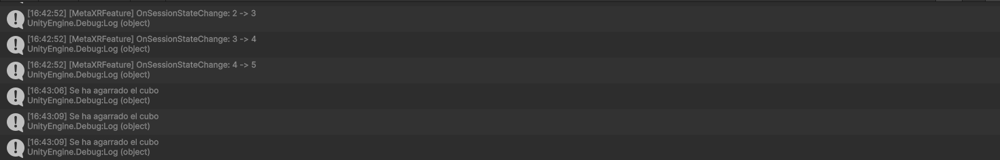

# Interfaces Inteligentes. Práctica 6. XR Interaction Toolkit.

## Ejercicio.

Para la realización de este ejercicio, ha sido necesario, además de toda la configuración previa, añadir el GameObject `XR Origin (XR Rig)`, que nos ha servido como controlador. 

Por otra parte, se han creado también un primer cubo que se ha colocado en la lejanía y al que se le ha añadido el componente `XR Simple Interactable`. Luego, se ha creado el siguiente [script](scripts/CambioColorSeleccion.cs), en el que se han definido los métodos `OnSelectEnter(SelectEnterEventArgs informacionSelect)` y `OnSelectExit(SelectExitEventArgs informacionSelect)` para luego suscribirlos manualmente desde el inspector de propiedades a `SelectEntered` y `SelectExited` del componente.

Luego, se ha colocado un segundo cubo, esta vez más cercano al jugador, solo que en este caso se le ha añadido el component `XR Grab Interactable`. Seguidamente, se ha seguido un proceso similar al anterior, creando un [script](scripts/MensajeAlAgarrar.cs) con un método `MensajeAlAgarrar.LanzarMensaje(SelectEnterEventArgs informacionSelect)` que luego se ha suscrito mediante el inspector de propiedades a `SelectEntered` del component del propio cubo.

De esta forma, al agarrar el cubo en la simulación, conseguimos que se muestre por pantalla el siguiente mensaje:

Adicionalmente, ha sido necesario acceder al asset encargado del movimiento del prefab que colocamos para hacer de jugador y seguir la siguiente ruta:

`Action Maps` -> `XRI Right Interaction` -> `Select` -> `Add Binding` -> `TriggerButton \[RightHand XR Controller\]`

Todo esto con el objetivo de enlazar la función select con el trigger del mando derecho y así poder interactuar con los elementos de la escena que habíamos configurado previamente.

El siguiente gif muestra el resultado final:
